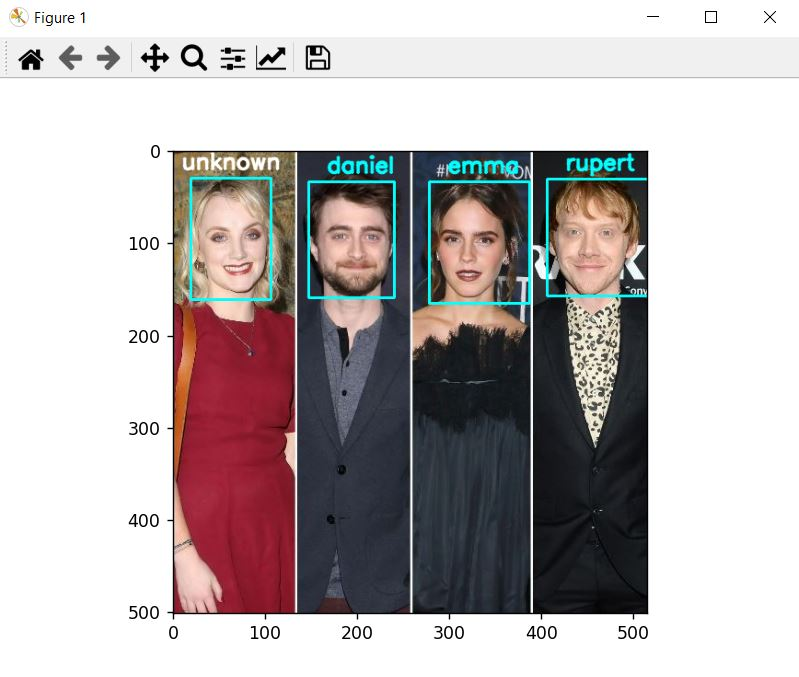

# Face Verification

in this project we have used [`insightface`](https://github.com/deepinsight/insightface) package for face analysis task .

+ it's Detection Model :  SCRFD 
+ it's Recognition Model  :  ResNet
<br/>

###  Reasons for using insightface :
+ 1_ in previous methods we had to have LARGE DATASET for achieving a good result in face-recognition
+ 2_ if we had a new person in our dataset , we had to train our model again . So for each new person we have same problem .
+ 3_ if we have only ONE person in our dataset , like face-verification for unlocking smart phones . here , argmax always have the same result . therefore , It gives the same fixed result for wrong results.

### benefits of this package :
+ 1_ it has been trained on BIG DATASETS .

+ 2_ in inference part , we use Features which CNN has created , but we dont use MLP for classification .
We extract a feature vector for each person . 
realted features into each person , have Min distances between themselves . 


## part_1 : face verification file : 
verify that two images are related to one person or not . 

## part_2 : face identification :
we want to identify persons in pictures .

```
the Face bank that we are using here  , is NOT A DATASET . 
because we dont want to "train" anything here . 
we are only going to extract features and use them . 
```


# How to install

``` 
pip install -r requirements.txt 
```


# How to run 

```
python face_verification.py --image_1 "./me1.jpg" --image_2 "./me2.jpg"
```

# Results :

